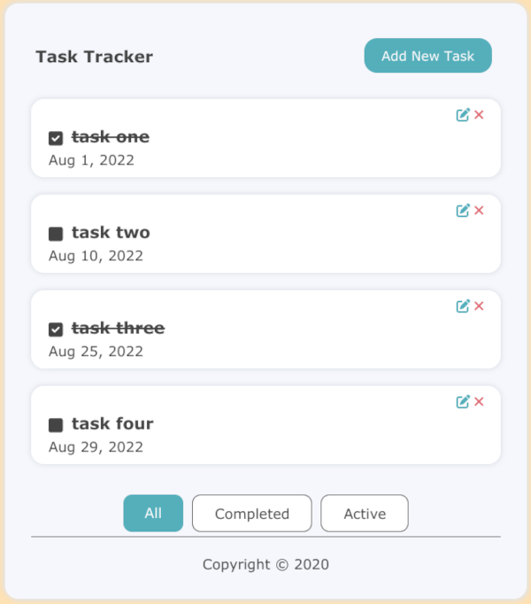
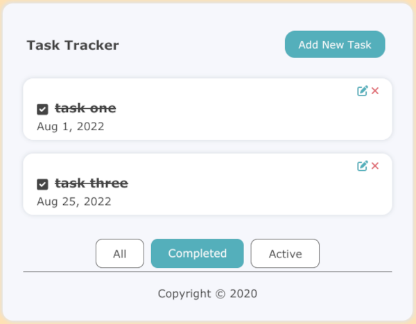
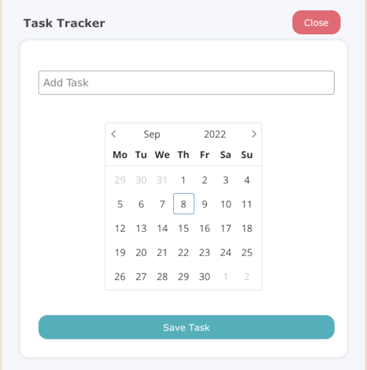

# Task Tracker
A task tracker app with CRUD API

using vue 3 for the frontend and node, express and mongo for the backend.

## Project setup

### Database setup
- create .env file in /backend
- add the following keys with values to .env
	- MONGO_DB 
	- MONGO_USER
	- MONGO_PWD
- db:up

### Install
- npm run frontend:install
- npm run backend:install

### Compiles and hot-reloads for development
- npm run frontend:serve
- npm run bakcend:dev
